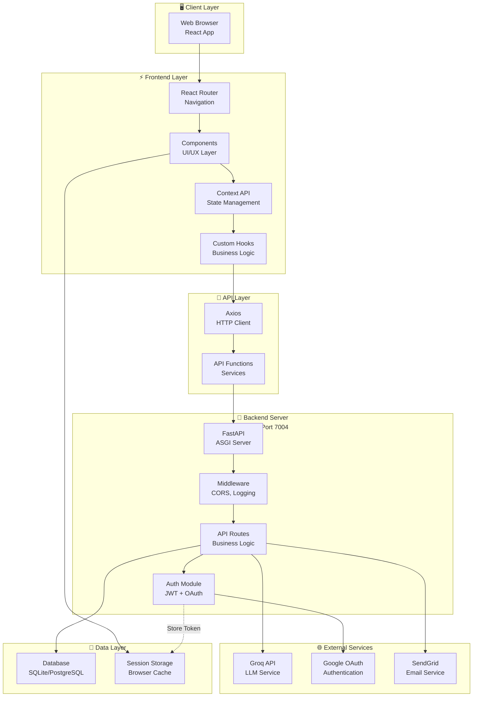

# ChatPaat: System Architecture

## 🏗️ Overview

ChatPaat follows a **Client-Server Architecture** with clear separation between frontend and backend. The system is designed to be scalable, maintainable, and follows industry best practices for modern web applications.

### Architecture Type
- **Pattern**: Three-Tier Architecture (Presentation, Business Logic, Data)
- **Style**: REST API with decoupled frontend
- **Scalability**: Monolithic but microservice-ready
- **Deployment**: Containerizable for cloud platforms

---

## 🎯 High-Level Architecture Diagram



---

## 📦 System Components

### 1. **Frontend Application** (React + TypeScript)
**Location**: `/frontend/`  
**Framework**: React 18 with TypeScript  
**Build Tool**: Vite 5.4  
**Port**: 5173 (Development)

#### Key Components
```
frontend/
├── src/
│   ├── pages/              # Page components
│   ├── components/         # Reusable UI components
│   ├── context/            # React Context (Auth, Theme, Toast)
│   ├── hooks/              # Custom React hooks
│   ├── lib/                # Utility functions and API calls
│   ├── styles/             # Global styles
│   ├── App.tsx             # Main app component
│   └── main.tsx            # Entry point
└── vite.config.ts          # Vite configuration
```

**Responsibilities**:
- Render user interface
- Handle user interactions
- Manage local state (Context API + React Query)
- Communicate with backend via HTTP
- Store authentication tokens in sessionStorage
- Render markdown and code highlighting

---

### 2. **Backend Server** (FastAPI)
**Location**: `/fastapi_backend/`  
**Framework**: FastAPI 0.104  
**Server**: Uvicorn 0.24  
**Port**: 7004  
**Language**: Python 3.x

#### Key Modules

```
fastapi_backend/
├── fastapi_server.py       # Server initialization & CORS setup
├── routes.py               # All API endpoints (~900+ lines)
├── models.py               # SQLAlchemy ORM models
├── auth.py                 # JWT & password utilities
├── db.py                   # Database configuration
├── email_utils.py          # SendGrid email integration
├── requirements.txt        # Python dependencies
├── db.sqlite3              # SQLite database file
└── scripts/                # Utility scripts
```

**Responsibilities**:
- Define and implement REST API endpoints
- Handle authentication (JWT + OAuth)
- Process business logic
- Database queries and updates
- Integrate with external services (Groq, Google, SendGrid)
- Validate user input
- Return appropriate HTTP responses

---

### 3. **Database Layer**
**Type**: SQLite (development) / PostgreSQL (production)  
**ORM**: SQLAlchemy 2.0  
**Location**: `./db.sqlite3` (SQLite) or PostgreSQL server

#### Core Entities
```
CustomUser (Users) ─────┐
                        ├── Chat (Conversations)
                        │   └── ChatMessage (Messages)
                        └── UserSearchHistory
                        └── PasswordResetToken
```

**Responsibilities**:
- Persist user data (credentials, profiles)
- Store conversation history
- Maintain search history
- Handle password reset tokens
- Enforce data integrity through relationships

---

### 4. **External Services Integration**

#### A. **Groq API** (AI/LLM Service)
- **Model**: openai/gpt-oss-20b
- **Purpose**: Generate AI responses to user messages
- **Integration**: Used in `prompt_gpt()` endpoint
- **Response Format**: JSON with `choices[0].message.content`

#### B. **Google OAuth 2.0** (Authentication)
- **Purpose**: Enable one-click sign-in with Google accounts
- **Flow**: Authorization Code → Token Exchange → User Info
- **Integration**: `google_exchange()` endpoint
- **User Upsert**: Creates users automatically on first login

#### C. **SendGrid API** (Email Service)
- **Purpose**: Send password reset emails
- **Integration**: `send_email()` function in `email_utils.py`
- **Use Cases**: Password reset links, notification emails
- **Configuration**: Requires `SENDGRID_API_KEY` and `SENDER_EMAIL`

---

## 🔄 Data Flow Architecture

### 1. **Message/Chat Flow** (Most Common)
```
User Input 
  ↓
Frontend Input Handler
  ↓
Axios HTTP POST to /prompt_gpt/
  ↓
FastAPI Route Handler (get_current_user)
  ↓
JWT Token Verification
  ↓
Chat Creation/Retrieval from DB
  ↓
Add User Message to DB
  ↓
Groq API Request (LLM Inference)
  ↓
Add AI Response to DB
  ↓
Return Response to Frontend
  ↓
Update React State
  ↓
Render Message in UI
```

### 2. **Authentication Flow** (Login)
```
User Email/Password
  ↓
Frontend /api/login/ POST
  ↓
FastAPI login() Route
  ↓
Query User by Email
  ↓
Verify Password (Argon2)
  ↓
Generate Access Token (JWT)
  ↓
Generate Refresh Token (JWT)
  ↓
Return Tokens to Frontend
  ↓
Store in sessionStorage
  ↓
Redirect to Home
```

### 3. **OAuth Flow** (Google Sign-In)
```
User Clicks "Sign In with Google"
  ↓
Google Authorization Dialog
  ↓
User Grants Permission
  ↓
Frontend Receives Authorization Code
  ↓
Frontend POST /api/auth/google/exchange/
  ↓
Backend Exchanges Code for Google Access Token
  ↓
Backend Fetches User Info from Google
  ↓
Query/Create User in Database
  ↓
Generate Local JWT Tokens
  ↓
Return Tokens to Frontend
  ↓
Redirect to Home
```

### 4. **Profile Update Flow**
```
User Edits Profile
  ↓
Frontend Form Submission
  ↓
Axios PUT /api/profile/
  ↓
JWT Token Validation
  ↓
Check Email Uniqueness (if changed)
  ↓
Update User Record in DB
  ↓
Return Updated User Data
  ↓
Update Frontend State
  ↓
Show Success Toast
```

---

## 🔐 Authentication & Authorization

### JWT Token Structure
```
Header:  { "alg": "HS256", "typ": "JWT" }
Payload: { "sub": "user_id", "exp": timestamp }
Signature: HMAC-SHA256(header.payload, SECRET_KEY)
```

### Token Types
| Token Type | Duration | Purpose | Storage |
|------------|----------|---------|---------|
| Access Token | 24 hours | API authorization | sessionStorage |
| Refresh Token | 7 days | Token renewal | sessionStorage |

### Authorization Model
- **User Isolation**: Every user can only access their own data
- **Chat Access Control**: Verify `chat.user_id == authenticated_user.id`
- **Profile Access**: Only authorized user can modify own profile
- **Admin Flags**: `is_staff`, `is_superuser` for future admin features

---

## 📡 API Communication Pattern

### Request/Response Cycle

```
Frontend Request:
{
  method: "POST|GET|PUT|DELETE|PATCH",
  url: "http://127.0.0.1:7004/api/...",
  headers: {
    "Authorization": "Bearer <JWT_TOKEN>",
    "Content-Type": "application/json"
  },
  body: { /* Pydantic schema */ }
}

Backend Processing:
1. Parse request
2. Extract & verify JWT token
3. Query user from database
4. Validate request body against Pydantic schema
5. Execute business logic
6. Return response

Response Format:
{
  "status": 200,
  "data": { /* response data */ }
}

Error Response:
{
  "detail": "Error message"
}
```

---

## 🗄️ Database Architecture

### Database Schema Overview

```
TABLE: chatpaat_app_customuser
├── id (PRIMARY KEY, AUTO_INCREMENT)
├── username (UNIQUE, NOT NULL)
├── email (UNIQUE, NOT NULL)
├── password (HASHED, NOT NULL)
├── first_name (VARCHAR)
├── last_name (VARCHAR)
├── is_active (BOOLEAN, DEFAULT: true)
├── is_staff (BOOLEAN, DEFAULT: false)
├── is_superuser (BOOLEAN, DEFAULT: false)
├── last_login (DATETIME)
└── date_joined (DATETIME, DEFAULT: NOW)

TABLE: chatpaat_app_chat
├── id (PRIMARY KEY, UUID)
├── user_id (FOREIGN KEY → CustomUser)
├── title (VARCHAR)
├── created_at (DATETIME)
└── updated_at (DATETIME)

TABLE: chatpaat_app_chatmessage
├── id (PRIMARY KEY, AUTO_INCREMENT)
├── chat_id (FOREIGN KEY → Chat)
├── role (VARCHAR: 'user' | 'assistant')
├── content (TEXT)
└── created_at (DATETIME)

TABLE: chatpaat_app_usersearchhistory
├── id (PRIMARY KEY, AUTO_INCREMENT)
├── user_id (FOREIGN KEY → CustomUser)
├── search_query (TEXT)
└── created_at (DATETIME)

TABLE: chatpaat_app_passwordresettoken
├── id (PRIMARY KEY, AUTO_INCREMENT)
├── user_id (FOREIGN KEY → CustomUser)
├── token_hash (VARCHAR, HASHED)
├── used (BOOLEAN)
├── expires_at (DATETIME)
└── created_at (DATETIME)
```

### Relationships
- **1:N User → Chats**: One user has many chats
- **1:N Chat → Messages**: One chat has many messages
- **1:N User → Search History**: User searches tracked
- **1:N User → Password Reset Tokens**: Multiple reset tokens per user

---

## 🚀 Deployment Architecture

### Development Setup
```
localhost:5173 (React Dev Server)
        ↓
    Axios
        ↓
localhost:7004 (FastAPI)
        ↓
    SQLite DB
```

### Production Setup
```
Frontend:                    Backend:                Database:
- Static hosting            - Cloud VM/Container    - Managed PostgreSQL
- CDN for assets            - Uvicorn + Supervisor  - Automated backups
- Vite build output         - Environment vars      - Replication
```

---

## 🔌 API Endpoints Structure

### Authentication Endpoints
```
POST   /api/register/                    # User registration
POST   /api/login/                       # User login
POST   /api/auth/password-reset/         # Initiate password reset
POST   /api/auth/password-reset/confirm/ # Confirm password reset
POST   /api/auth/google/exchange/        # OAuth token exchange
```

### Profile Endpoints
```
GET    /api/profile/                     # Get user profile
PUT    /api/profile/                     # Update profile
POST   /api/profile/upload-image/        # Upload profile image
POST   /api/profile/change-password/     # Change password
DELETE /api/profile/                     # Delete account
```

### Chat Endpoints
```
POST   /prompt_gpt/                      # Send message & get response
GET    /get_chat_messages/{chat_id}/     # Fetch chat history
GET    /todays_chat/                     # Get today's chats
GET    /yesterdays_chat/                 # Get yesterday's chats
GET    /seven_days_chat/                 # Get last 7 days chats
DELETE /delete_chat/{chat_id}/           # Delete chat
```

### Utility Endpoints
```
POST   /api/store_search/                # Store search query
GET    /health/                          # Health check
GET    /                                 # Documentation root
```

---

## 📊 Performance Considerations

### Frontend Optimization
- **Lazy Loading**: React Router lazy route loading
- **Code Splitting**: Vite automatic chunking
- **Image Optimization**: DiceBear API for avatars
- **Caching**: Browser cache + sessionStorage for tokens
- **State Caching**: React Query for server state

### Backend Optimization
- **Database Indexing**: Indexes on foreign keys and email
- **Connection Pooling**: SQLAlchemy session management
- **JWT Caching**: Token verification without DB hits
- **Request Validation**: Pydantic validation before processing
- **CORS Caching**: max_age=3600 for preflight requests

### Database Optimization
- **Primary Keys**: Auto-increment for performance
- **Foreign Keys**: Proper relationships for join optimization
- **Cascading Deletes**: Automatic cleanup on user deletion
- **Timestamp Indexing**: For chat history queries

---

## 🔒 Security Architecture

### Security Layers

```
┌─────────────────────────────────────────┐
│         Application Layer               │
│   Input Validation, Business Logic      │
└─────────────────────────────────────────┘
              ↓
┌─────────────────────────────────────────┐
│     Authentication Layer                │
│   JWT Tokens, OAuth, User Verification  │
└─────────────────────────────────────────┘
              ↓
┌─────────────────────────────────────────┐
│     Authorization Layer                 │
│   User Isolation, Access Control        │
└─────────────────────────────────────────┘
              ↓
┌─────────────────────────────────────────┐
│      Network Layer                      │
│   HTTPS, CORS, Origin Validation        │
└─────────────────────────────────────────┘
              ↓
┌─────────────────────────────────────────┐
│      Database Layer                     │
│   Encrypted Passwords, Data Isolation   │
└─────────────────────────────────────────┘
```

### Key Security Features
- ✅ Password hashing with Argon2
- ✅ JWT tokens with expiration
- ✅ CORS whitelisting
- ✅ Input validation (Pydantic)
- ✅ SQL injection prevention (ORM)
- ✅ User data isolation
- ✅ Secure password reset flow
- ✅ OAuth integration with Google

---

## 📈 Scalability Considerations

### Current Architecture Limits
- **SQLite**: Best for < 10 concurrent connections
- **Single FastAPI Instance**: Handles ~1000 RPS
- **Frontend**: Static files can be cached indefinitely

### Scaling Strategies

#### Horizontal Scaling
1. **Database**: Migrate from SQLite to PostgreSQL
2. **Backend**: Deploy multiple FastAPI instances behind load balancer
3. **Frontend**: Use CDN for static asset distribution
4. **Cache**: Add Redis for session/token caching

#### Vertical Scaling
1. Increase server RAM for FastAPI process
2. Optimize database queries with better indexes
3. Implement caching layers

### Future Microservices
```
monolith → microservices
├── Auth Service (JWT, OAuth, Password Reset)
├── Chat Service (Message processing)
├── User Service (Profile, Account management)
├── AI Service (Groq API integration)
└── Email Service (SendGrid integration)
```

---

## 🛠️ Technology Decisions

### Why FastAPI?
- Fast, modern Python framework (high performance)
- Built-in data validation (Pydantic)
- Automatic API documentation (Swagger UI)
- Async/await support for I/O-bound operations
- Type hints for better code clarity

### Why React?
- Component-based architecture
- Excellent ecosystem and library support
- Large community for problem-solving
- Great developer experience with React DevTools
- TypeScript integration for type safety

### Why SQLAlchemy?
- ORM abstracts database-specific SQL
- Type-safe queries with Python code
- Easy migration path from SQLite to PostgreSQL
- Built-in relationship handling
- Session management for connection pooling

### Why JWT Tokens?
- Stateless authentication (server doesn't store sessions)
- Scalable to distributed systems
- Clear expiration mechanism
- Self-contained with standard claims
- Compatible with OAuth flows

---

## 📝 Next Steps & Related Documentation

1. **Backend Details**: See `02_Backend_Documentation.md`
2. **Frontend Architecture**: See `03_Frontend_Documentation.md`
3. **Database Schema**: See `04_Database_Documentation.md`
4. **Complete API Reference**: See `07_API_Documentation.md`
5. **Security Details**: See `08_Security_and_Authentication.md`
6. **Deployment**: See `09_Deployment_and_Environment.md`

---

**Architecture Last Updated**: Q1 2026  
**Diagram Source**: Mermaid JS  
**Maintainer**: Development Team
