# ChatPaat: Workflow & Flowcharts

## 🔄 Overview

This document provides detailed flowcharts and process diagrams for all major user workflows and system operations in ChatPaat.

---

## 📱 User Workflows

### 1. **User Registration & Sign-In Flow**

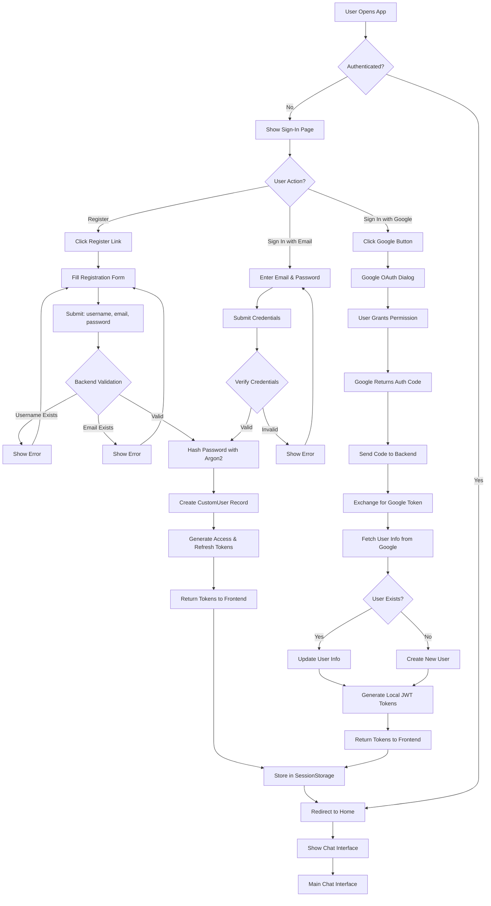

---

### 2. **Chat & Message Flow**

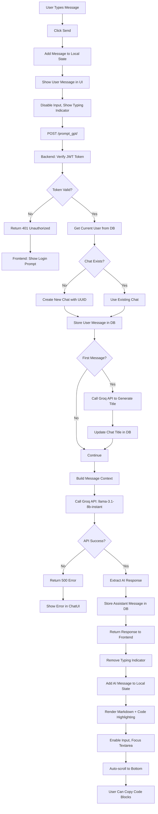

---

### 3. **Chat History Organization Flow**

```mermaid
flowchart TD
    A[User Opens App] --> B[AppSidebar Component Loads]
    B --> C[Calculate Time Filters]
    C --> D[Today 00:00:00]
    C --> E[Yesterday Boundaries]
    C --> F[Last 7 Days]
    
    D --> G[GET /todays_chat/]
    E --> H[GET /yesterdays_chat/]
    F --> I[GET /seven_days_chat/]
    
    G --> J{Database Query}
    J --> K[WHERE user_id = ? AND created_at >= today]
    K --> L[ORDER BY created_at DESC]
    L --> M[Return Chat List]
    
    H --> N[WHERE user_id = ? AND created_at >= yesterday...]
    N --> O[Return Chat List]
    
    I --> P[WHERE user_id = ? AND created_at >= 7_days_ago...]
    P --> Q[Return Chat List]
    
    M --> R[Display Today's Chats]
    O --> S[Display Yesterday's Chats]
    Q --> T[Display Last 7 Days Chats]
    
    R --> U[User Clicks Chat]
    S --> U
    T --> U
    
    U --> V[Fetch Chat ID]
    V --> W[GET /get_chat_messages/{chat_id}/]
    W --> X[Query All Messages for Chat]
    X --> Y[Return Sorted Message List]
    Y --> Z[Update HomePage State]
    Z --> AA[Render Messages in Chat View]
```

---

### 4. **Profile Management Flow**

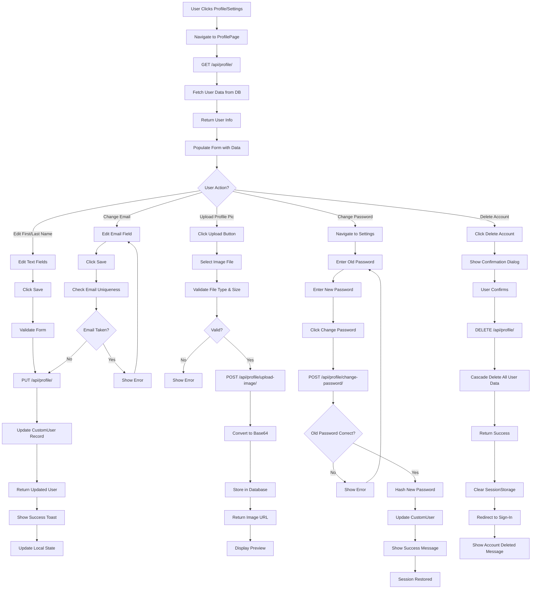

---

### 5. **Password Reset Flow**

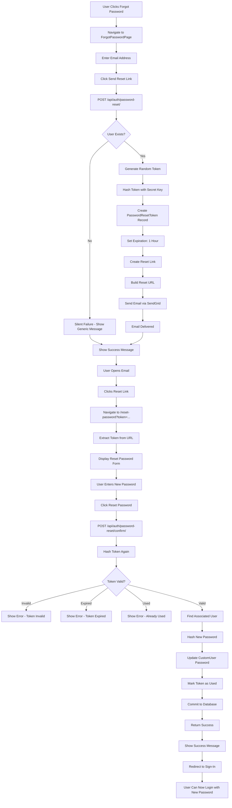

---

## 🔐 Authentication Flows

### **JWT Token Refresh** (Future Enhancement)

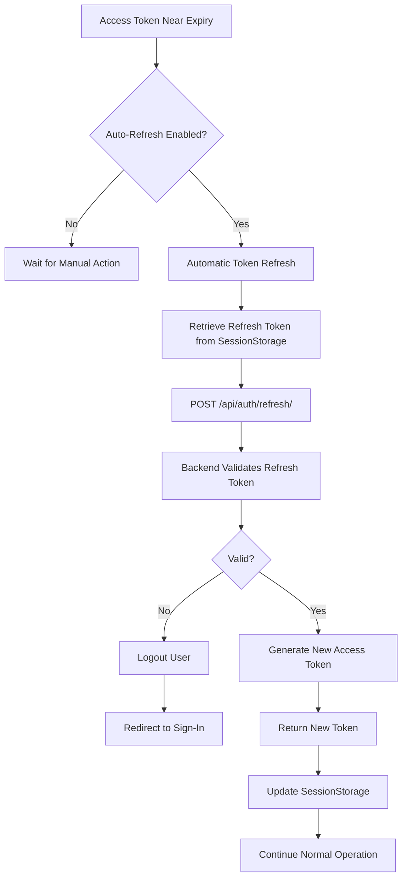

---

### **API Request Authorization**

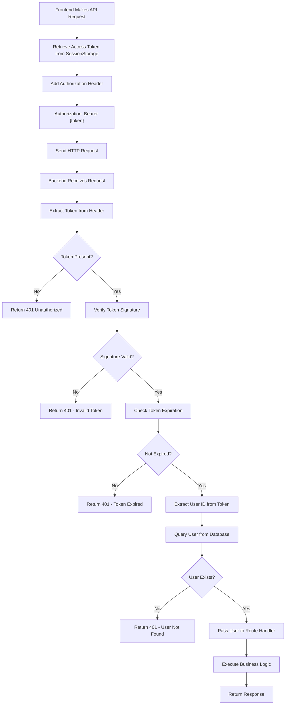

---

## 💬 Message Processing Flow

### **Detailed Message & AI Response Generation**

```mermaid
flowchart TD
    A[User Submits Message] --> B[Add to React State]
    B --> C[POST /prompt_gpt/ with chat_id & content]
    
    C --> D[Backend Receives Request]
    D --> E[Verify JWT & Get User]
    E --> F[Create/Retrieve Chat from DB]
    F --> G[Save User Message to ChatMessage Table]
    
    G --> H[Query Previous Messages from DB]
    H --> I[Build Groq API Payload]
    I --> J["[system, ..., user msg n-1, assistant msg n-1, user msg n]"]
    
    J --> K[POST to Groq API]
    K --> L[Call: llama-3.1-8b-instant model]
    L --> M[Groq Processes Context Window]
    M --> N[Generate Response Tokens]
    
    N --> O[Return Response JSON]
    O --> P[Extract response text]
    P --> Q[Save AI Message to ChatMessage Table]
    Q --> R[Return Response to Frontend]
    
    R --> S[Frontend Receives Response]
    S --> T[Update Messages State]
    T --> U[Re-render Chat Interface]
    U --> V[Render Markdown Content]
    V --> W[Syntax Highlight Code Blocks]
    W --> X[Display to User]
```

---

## 🔄 Data Synchronization Flow

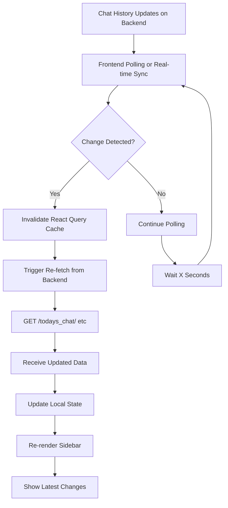

---

## 📊 System Operation Flows

### **Groq API Integration Flow**

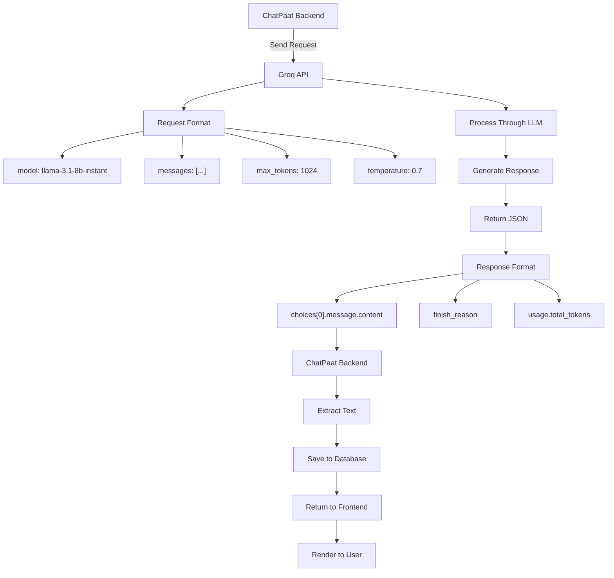

---

### **Email Service Integration Flow**

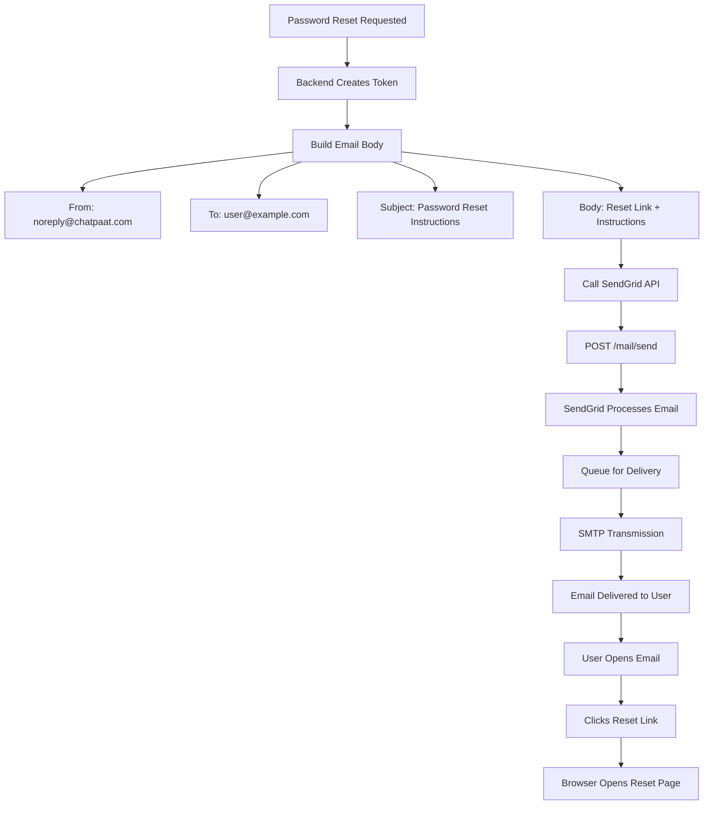

---

## 🎨 Frontend State Management Flow

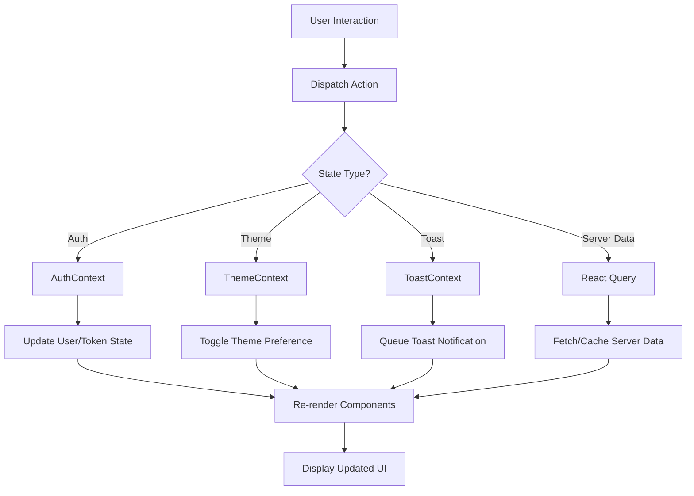

---

## 🚀 Error Handling Flow

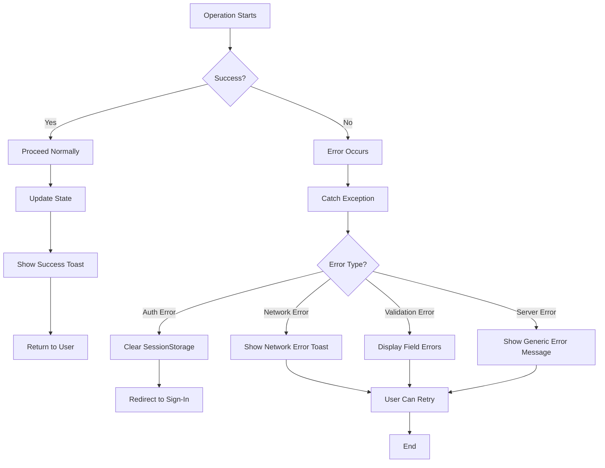

---

## ⏱️ Timing & Sequence Diagram

### **Complete Message Flow with Timing**

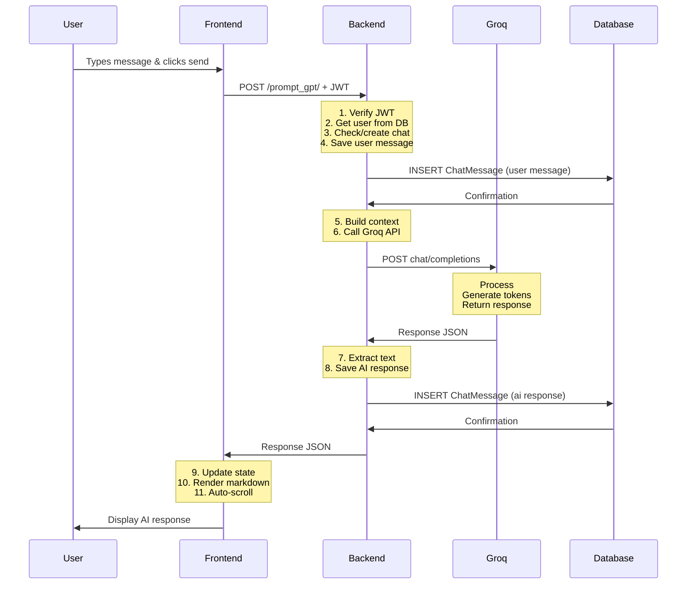

---

## 📚 Related Documentation

- **API Details**: See `07_API_Documentation.md`
- **Backend Logic**: See `02_Backend_Documentation.md`
- **Frontend Logic**: See `03_Frontend_Documentation.md`

---

**Workflow Documentation Last Updated**: Q1 2026  
**Diagram Tool**: Mermaid JS
